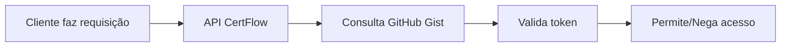

# 🌐 Integração CertFlow + GitHub

## ✨ Portal Online + Validação via GitHub

Agora o portal CertFlow está integrado com o GitHub para gerenciamento seguro de tokens!

### 🔗 Links Importantes

- **Portal Administrativo**: https://romesfreitas.github.io/certflowportal/
- **API Local**: http://localhost:8080
- **Swagger**: http://localhost:8080/swagger

### 🚀 Como Configurar

#### 1. Configurar GitHub Personal Access Token

1. Acesse: https://github.com/settings/tokens
2. Clique em "Generate new token (classic)"
3. Selecione os escopos:
   - `gist` (para criar e editar Gists)
4. Copie o token gerado

#### 2. Configurar Portal Web

1. Acesse: https://romesfreitas.github.io/certflowportal/
2. Clique em "Conectar GitHub" no cabeçalho
3. Insira:
   - Usuário: `romesfreitas`
   - Token: `seu_token_aqui`
   - Gist ID: deixe vazio (será criado automaticamente)

#### 3. Configurar API CertFlow

Edite o arquivo `appsettings.json`:

```json
{
  "GitHub": {
    "GistId": "SEU_GIST_ID_AQUI",
    "GistFilename": "certflow_tokens.json",
    "Username": "romesfreitas"
  }
}
```

### 🔧 Como Funciona

#### **Fluxo Completo:**

1. **Portal Web** (GitHub Pages) → Gerencia tokens no GitHub Gist
2. **GitHub Gist** → Armazena dados de clientes e tokens
3. **API CertFlow** → Consulta GitHub Gist para validar tokens

#### **Processo de Validação:**



### 📋 Vantagens da Integração

✅ **Centralizado**: Tokens gerenciados em um local seguro
✅ **Online**: Portal acessível de qualquer lugar
✅ **Versionado**: Histórico de mudanças no GitHub
✅ **Seguro**: Gist privado com controle de acesso
✅ **Escalável**: Fácil de expandir e manter

### 🛠 Testando a Integração

#### 1. Criar Cliente no Portal
```bash
# Acesse: https://romesfreitas.github.io/certflowportal/
# Clique em "Novo Cliente"
# Preencha os dados e gere o token
```

#### 2. Testar na API
```bash
# Usar token gerado no portal
curl -X POST "http://localhost:8080/api/pdf/merge-and-sign" \
  -H "Authorization: Bearer SEU_TOKEN_DO_PORTAL" \
  -H "Content-Type: application/json" \
  -d '{...}'
```

### 🔐 Segurança

- **Gist Privado**: Dados não são públicos
- **Token Criptografado**: Acesso controlado via GitHub
- **Logs Completos**: Rastreamento de uso
- **Expiração Automática**: Tokens têm validade

### 📊 Monitoramento

O portal fornece:
- Dashboard com estatísticas
- Histórico de tokens
- Logs de uso
- Status em tempo real

### 🆘 Troubleshooting

#### Erro: "GitHub Gist ID não configurado"
- Configure o `GistId` no `appsettings.json`
- Ou deixe vazio para criar automaticamente

#### Erro: "Erro ao acessar GitHub Gist"
- Verifique se o token GitHub está válido
- Confirme se o Gist existe
- Verifique conectividade com GitHub

#### Token não funciona
- Verifique se foi criado no portal conectado ao GitHub
- Confirme se não expirou
- Verifique se o cliente está ativo

### 🔄 Sincronização

- **Automática**: API consulta GitHub a cada validação
- **Tempo Real**: Mudanças no portal são imediatas
- **Cache**: Implementar cache local se necessário

---

**Agora você tem um sistema completo de gerenciamento de tokens online!** 🎉
